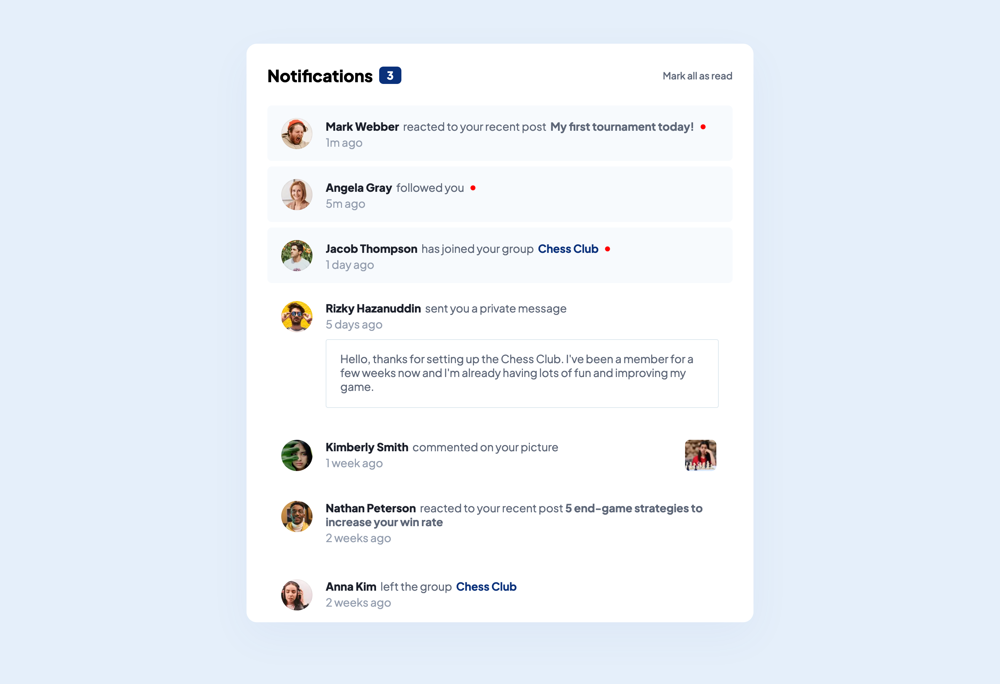
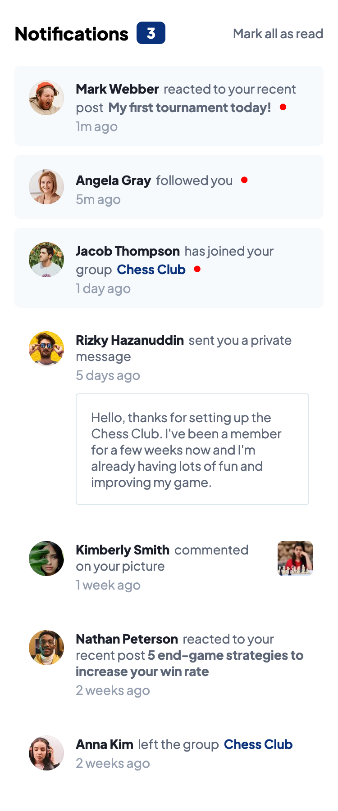

# Frontend Mentor - Notifications page solution

This is a solution to the [Notifications page challenge on Frontend Mentor](https://www.frontendmentor.io/challenges/notifications-page-DqK5QAmKbC). Frontend Mentor challenges help you improve your coding skills by building realistic projects. 

&nbsp;  
## Table of contents

- [Overview](#overview)
  - [The challenge](#the-challenge)
  - [Screenshot](#screenshot)
  - [Links](#links)
- [My process](#my-process)
  - [Built with](#built-with)
  - [What I learned](#what-i-learned)
- [Author](#author)

&nbsp;  
## Overview

### The challenge

Users should be able to:

- Distinguish between "unread" and "read" notifications
- Select "Mark all as read" to toggle the visual state of the unread notifications and set the number of unread messages to zero
- View the optimal layout for the interface depending on their device's screen size
- See hover and focus states for all interactive elements on the page

&nbsp;  
### Screenshot

&nbsp;  

&nbsp;  
### Links

- Solution URL: (https://github.com/JakeHand/notifications-page)
- Live Site URL: [Add live site URL here](https://your-live-site-url.com)

&nbsp;  
## My process

### Built with

- Semantic HTML5 markup
- CSS custom properties
- Flexbox
- CSS Grid
- Mobile-first workflow

&nbsp;  
### What I learned

Another easy enough project. I plan to start using React soon as I am feeling much more confident putting my HTML, CSS and JS together in these challenges. I have been learning React syntax for a while now, I just need to start implementing it into real projects.

&nbsp;  
## Author

I am looking for a remote internship / junior front end developer position. Contact me via email below.

- Email - jakehandp@gmail.com
- GitHub - [@JakeHand](https://github.com/JakeHand)
- Frontend Mentor - [@JakeHand](https://www.frontendmentor.io/profile/@JakeHand)